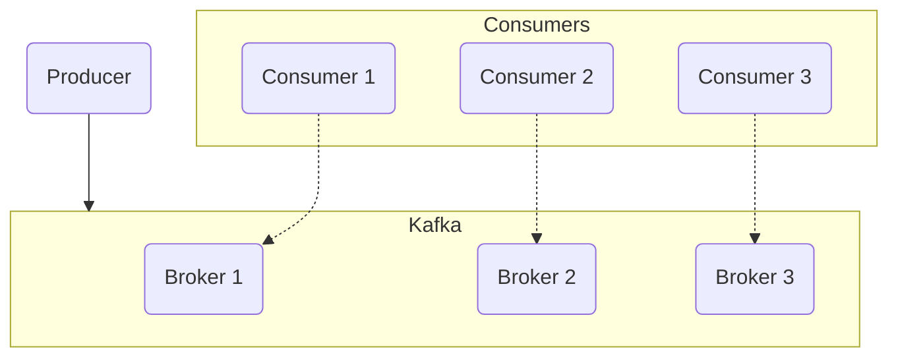
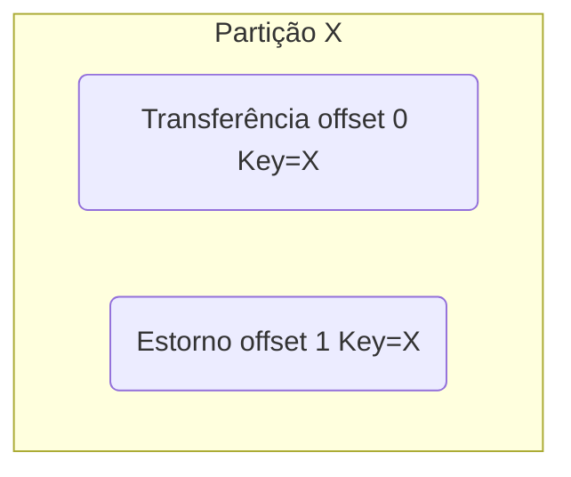
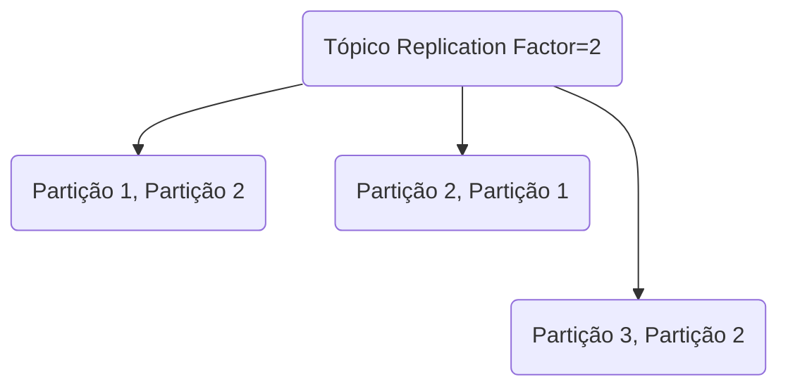
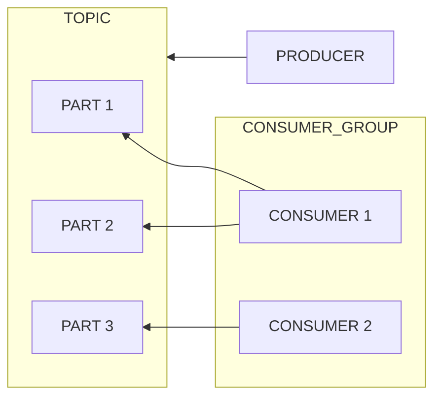

# Kafka

- plataforma distribuída de streaming de eventos/dados
- altíssimo throughput (capacidade de receber e processar requisições)
- baixa latência
- escalável
- armazenamento (resiliência)
- alta disponibilidade
- muitos drivers para se conectar com diversas tecnologias
- bibiliotecas prontas
- é um cluster de brokers(máquinas com seu proprio DB)
- Kafka guarda a mensagem e o consumer acessa o Kafka e lê a mensagem
- recomendação minima: 3 brokers
- zookepper: gerencia os brokers (esta sendo descontinuado)
- mensagens salvas em disco


## Tópicos
---
- canal de comunicação que recebe mensagens e disponibiliza aos consumers.
- consumer lêem as mensagens disponibilizadas
- mensagens tem seu offset próprio para indexação

## Partições
---
- registro(offset0) enviado é composto por:
  - Headers (metadata)
  - Key (define um agrupamento)
  - Value (conteúdo/payload)
  - Timestamp
- cada tópico pode ter uma ou mais partições que distribuem as mensagens para permitir leitura por N consumers

## Ordem da entrega
---
- a ordem das mensagens só pode ser garantida dentro da mesma partição
- a partir da key que cada mensagem possui, é possível definir que sejam enviadas para uma mesma partição garantindo a ordenação de leitura.


## Partições Distribuídas
---
- Ao se criar o tópico e definir as partições, é possível configurar também o Replication Factor para definir a qtde. de réplicas que cada partição deve ter como garantia caso um broker caia.


## Partition Leadership
---
- com uma partição replicada em diversos brokers, pode-se definir uma delas como líder, e com isso esta partição é de onde as mensagens serão lidas. Caso o broker da partição líder caia, o Kafka auto gerencia e defini outra partição de outro broker como líder para que as mensagens continuem sendo lidas.

## Producers - Garantia de Entrega por confirmação
---
- As mensagens são recebidas pelo Broker Leader e ele replica para os Brokers followers.

- Producer envia a mensagem para o Broker Leader com `Ack 0 None`, isto é, ele envia e não precisa ser notificado que a mensagem foi recebida. Trade-off: permite grande volume de mensagens onde não há grande risco de perda de algumas mensagens.

- Producer envia mensagem para o Broker Leader com `Ack 1 Leader`, neste cenário, o Broker notifica o Producer do recebimento da mensagem. Trade-off: garante-se a entrega mas perde-se em velocidade.

- Producer envia mensagem para o Broker Leader com `Ack -1 ALL`, o Broker Leader recebe a mensagem, replica para os Followers e somente após a replicação terminar com sucesso, notifica-se o  Producer. Trade-off: Garantia total de mensagem recebida e replicada, garantia 100% porém menos velocidade ainda mais.

## Producers - Garantia de Entrega por configuração
--- 
- `At most once`: garanto boa performance com perda de algumas mensagens.
- `At least once`: performance moderada com duplicação de algumas mensagens.
- `Exacly once`: baixa performance sem risco de duplicação e perda de mensagens.

## Producer: Indepotência
---
- ao configurar um Producer como indepotente, mesmo que uma mensagem seja enviada mais de uma vez devido a um erro de rede por exemplo, o Kafka descarta uma das mensagens e garante a unicidade, porém o trade-off é perda de performance.

## Consumer Groups
---
- Agrupar os consumer para que a leitura das mensagens sejam melhor distribuídas entre as partições. Por exemplo: 
- um tópico com 3 partições será lido por um Consumer Group com 2 Consumer, neste caso duas partições são lidas por um Consumer e a restante fica o o outro Consumer.
- 3 Partições X 3 Consumers: fica 1/1, cada partição fica com um Consumer.
- 3 Partições X 4 Consumers: fica 1/1, e um Consumer ficará sem ler nada.
- 3 Partições X 2 Consumers: Um Consumer fica com 2 partições e o outro com a Partição restante.
- 2 Consumers dentro de um grupo NUNCA lêem mensagens de uma mesma partição.
- 1 Consumer fora de um grupo ao ler de um tópico com N partições, lê as mensagens de todas as partições do tópico.



### Comandos Úteis
---

```
# criar tópico
kafka-topics --create --topic=teste --bootstrap-server=localhost:9092 --partitions=3

# listar tópicos
kafka-topics --list
# detalhes tópico
kafka-topics --describe --topic=teste

#console consumer - para ler tópicos
kafka-console-consumer --topic=teste --bootstrap-server=localhost:9092
# --from-beginning (lê todas as mensagens a partir do offset 0)
# --group=x (define o consumer-group)

#console producer - para produzir mensagens
kafka-console-producer --bootstrap-server=localhost:9092 --topic=teste

# detalhes de um consumer group
kafka-consumer-groups --bootstrap-server=localhost:9092 --group=x --describe
```

### Delivery Channel
---
Canal de entrega configurado ao produzir mensagens(callback), a partir de toda mensagem enviada, é possível ficar escutando o delivery channel para checar se as mensagens foram enviadas pelo retorno. (Go/Node)