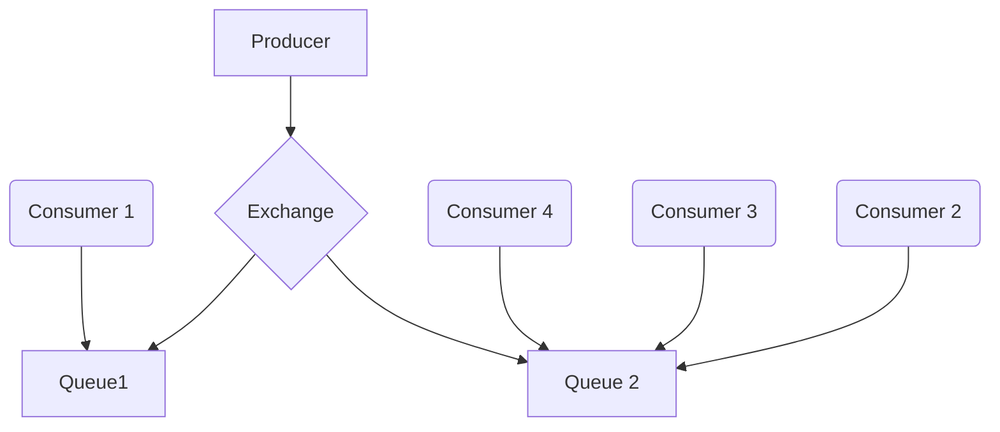

# RabbitMQ

- Message broker
- Desacoplamento entre serviços
- Mensagens ficam em memória 
- TCP com conexão persistente
- channels ficam na conexão persistente, e para cada channel é criada uma thread

## Estrutura


### Exchanges 
---
Responsável por definir em qual fila as mensagens serão enviadas

- Tipos de exchanges:
  - Direct: envia direto para uma fila (bind/relacionada)
    - Routing key X: chave que associa fila/exchange
  - Fanout: envia para N filas associadas à exchange
    - não trabalha com Routing Key, as mensagens são replicadas para as filas associadas
  - Topic: envia mensagens de acordo com regras definidas para qual fila enviar
    - Usa Routing key porém com regras, padrões, regex por exemplo
  - Headers: define no header a fila de destino


```mermaid
flowchart LR

  E[Exchange Direct]--> |bind by exact routing key => orders.books.logs| Q[Queue A]
  E--> |bind by exact routing key => orders.books.logs| QA2[Queue B]

  E3[Exchange Topic]--> |bind by pattern routing key => orders.*.logs| Q5[Queue F]
  E3--> |bind by pattern routing key => orders.*.logs| Q52[Queue I]
  E4[Exchange Topic]--> |bind by pattern routing key => issues.*.logs| Q6[Queue G]

  E2[Exchange Fanout]--> Q2[Queue C]
  E2--> Q3[Queue D]
  E2--> Q4[Queue E]

  E5[Exchange Headers]--> |bind by header key:value| Q7[Queue H]
 ``` 

### Queues
---
- Padrão FIFO: first in, first out
- é possível definir prioridade, porém quebra o padrão FIFO
- Propriedades de uma queue:
  - Durable: define se deve ser salva em caso em que o broker é reiniciado
  - Auto-delete: define se após desconexão do consumidor a fila será removida
  - Expire: tempo de espera até que a fila será removida quando mensagens não estao sendo mais lidas(ociosidade)
  - TTL: tempo de vida da mensagem
  - Overflow: define regras de transbordo de uma fila:
    - drop head - remove a mensagem mais antiga quando se atinge o limite definido
    - reject publish - atinge o limite e rejeita novas mensagens
  - Exclusive: fila exclusivas pelo channel que criou a fila
  - Max Length/bytes: define capacidade de mensagens que a fila suporta(quantidade/tamanho), aitngiu o limite ai são acionadas as regras de overflow

### Dead Letter Queues
---
- Mensagens não entregues, expiradas, etc que ficaram paradas em uma fila
- Configura-se uma exchange que envia estas mensagens à uma Dead Letter Queue

### Lazy Queues
---
- mensagens armazenadas em disco quando os consumidores não dão conta de leitura das mensagens em memória
- para fluxo grande de mensagens

### Confiabilidade
---
- Consumer Acknowledgement: confirmação de recebimento
  - Basic Ack: consumer confirma recebimento
  - Basic Reject: consumer não recebeu por algum erro e a mensagem volta para a fila
  - Basic Nack: faz o que o Reject faz mas para mais de uma mensagem
- Publisher Confirm: confirmação entre Publisher e Exchange por ID da mensagem(Ack/Nack ID = 1)
- Filas e Mensagens Duráveis/persistidas: gravação em disco